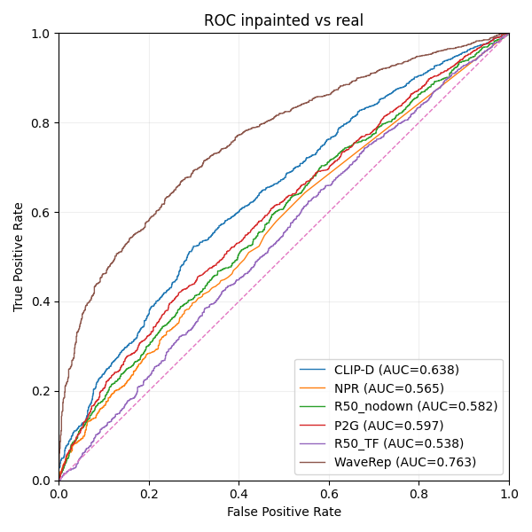

# Image Deepfake Detectors Adapter

## Base Repository

- [Image Deepfake Detectors Public Library](https://github.com/truebees-ai/Image-Deepfake-Detectors-Public-Library)

## Models

- [CLIP-D](https://github.com/grip-unina/ClipBased-SyntheticImageDetection)
- [NPR](https://github.com/chuangchuangtan/NPR-DeepfakeDetection)
- [P2G](https://github.com/laitifranz/Prompt2Guard)
- [R50_nodown](https://grip-unina.github.io/DMimageDetection)
- [R50_TF](https://github.com/MMLab-unitn/TrueFake-IJCNN25)
- [WaveRep](https://grip-unina.github.io/WaveRep-SyntheticVideoDetection/)

## Download Weights

You can download the weights for each model from this [link](https://drive.google.com/file/d/1F60FN2B9skRcb3YrZwhFTZQihbj3ipJQ/view?usp=sharing).

Then, copy them into the `weights` folder for the corresponding model, following this structure:
`./models/<DETECTOR>/weights/best.pt`

Download also the classes for P2G detector from [classes.pkl](https://github.com/laitifranz/Prompt2Guard/blob/main/src/utils/classes.pkl) and copy it into the `models/P2G/utils` folder.

## Dataset

The dataset used for evaluation is [B-Free](https://github.com/grip-unina/B-Free), downloaded from [here](https://www.grip.unina.it/download/prog/B-Free/training_data/).

## Results



## Usage

```bash
python3.13 detect.py \
    --folders <path/to/folder1> <path/to/folder2> ... \
    [--detectors all | CLIP-D NPR P2G R50_nodown R50_TF WaveRep ...] \
    [--weights <model1:/path/to/weights> <model2:/path/to/weights> ...] \
    [--limit 0 | <max images per folder>] \
    [--device cuda:0 | cpu] \
    [--batch_size 16] \
    [--output results.csv]
```

## Requirements

```bash
python3.13 -m pip install -r requirements.txt
```

```bash
conda env create -f environment.yml
```